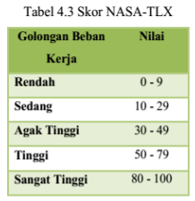

[](https://classroom.github.com/a/RumRVgk1)

 # Low-Code Platform for Improve Developer Interaction

  

## Latar Belakang

**Low-code Platfrom** adalah pendekatan pengembangan perangkat lunak yang memungkinkan pengembang membuat aplikasi dengan minimal coding. Dengan low-code, pengembang menggunakan bahasa visual berbasis model dengan antarmuka grafis drag-and-drop. Penelitian ini dilakukan dengan tujuan untuk mengetahui seberapa berpengaruh low code platfom membantu developer dalam pengembangan sistem. Penelitian ini dilakukan dengan melakukan survey tingkat beban kerja para developer ketika mengembangkan sistem menggunakan low code platform yaitu OutSystems dengan tradional method yaitu menggunakan React JS.

  

## Aparatus

1.  **React JS** : Sebuah pustaka (library) JavaScript yang digunakan untuk membangun antarmuka pengguna (UI) dalam aplikasi web. React dikembangkan oleh Facebook dan dirilis sebagai proyek open source. Salah satu fitur utama React adalah kemampuannya untuk membuat tampilan UI yang responsif dan efisien dengan menggunakan konsep komponen.

2.  **OutSystems** : Sebuah platform pengembangan aplikasi berbasis low-code yang memungkinkan pengembang untuk membuat, menguji, dan menyebarkan aplikasi perangkat lunak dengan cepat dan efisien. Pendekatan low-code dalam pengembangan aplikasi berarti bahwa pengguna dapat membuat aplikasi dengan lebih sedikit kode manual, mengurangi kompleksitas pengembangan dan mempercepat waktu rilis aplikasi.

  

## Partisipan

Partisipan pada penelitian ini terdiri dari 6 developer profesional dengan latar belakang dan pengalaman yang berbeda.

  

## Skenario Tugas

Para pengembang diminta untuk menyelesaikan tugas pengembangan sistem yang terdiri dari tiga bagian, yaitu:
  

1.  **Pre - Task** : Melakukan penyiapan perangkat lunak pendukung pada link https://bit.ly/tugas-imk-master dan membuat project React JS baru, dan/atau melakukan login ke dalam platform OutSystems.
- Pre-Task [React JS](https://youtu.be/qBunv5qYi0Y?si=CVKiKPH43zzd4N2x).
- Pre-Task [OutSystems](https://youtu.be/Sad6kIYY7yk?si=rAKSuHXqIBW95Zys).

2.  **Task - 1** : Membangun aplikasi dengan tujuan menampilkan halaman sederhana bertuliskan "Hello World."
- Task-1 [React JS](https://youtu.be/ExJycO_PuxU?si=7UycbhV6vxD19e70).
- Task-1 [OutSystems](https://youtu.be/GMiPcNhIPKw?si=CHkkYx84lX02_6b4).

3.  **Task - 2** : Membangun aplikasi dengan fokus menampilkan halaman yang berisi daftar siswa.
- Task-2 [React JS](https://youtu.be/rhUz0VIi13A?si=vgo1NhSg31m3UCNd).
- Task-2 [OutSystems](https://youtu.be/QkCpRhq_eUY?si=4hHIUbB-rMQYBXlP).

```
Note Akun OutSystem:  
Email : tugasimkrahmat@gmail.com  
Password : tugas!MK1234
```

Setelah partisipan selesai mengerjakan tugas-tugas di atas. Partisipan di minta untuk mengisi formulir survey berdasarkan NASA Task Load Index (TLX) yaitu dengan kategoeri sebagai berikut:



## Hasil
Hasil pada penelitian ini di paparkan pada folder Hasil Penelitian.